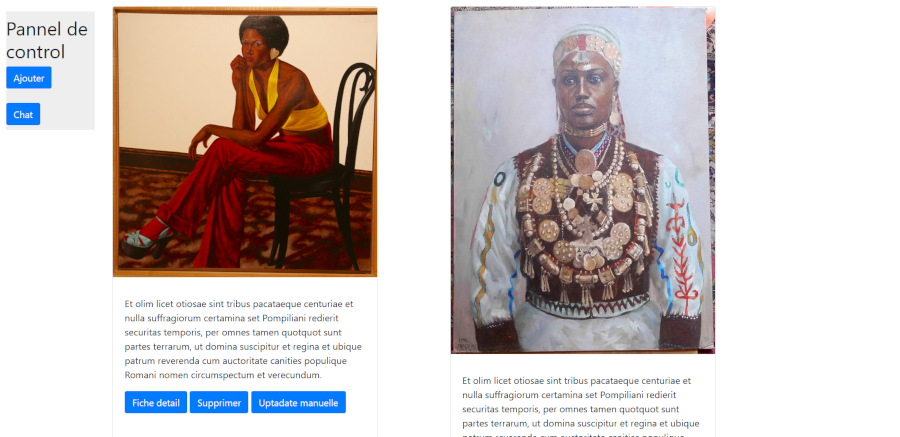

# TP Django  IIM EDSON DECARVALHO

This is the work of the Django class from 02/29/2020 to 02/01/2022 .




## Features

###Succeed :
(You will find this feautures in the 'app1' application)

*Deleting products<br>
*Adding products<br>
*Modifying products<br>
*Displaying all products 

###Not succed :
(You will find this feautures in the 'app1' app)

*Incrementation and decrementation of number of pruducts<br>


(You will find this feautures in the 'chat' app)

*Send a message between rooms <br>


## Usage
### for the (models file) :
To use the this project you hae to import the librery's :

```python
from django.db import models
import datetime
from django.utils import timezone
```
### for the (views file):
```python
from django.shortcuts import render,get_object_or_404
from django.http import HttpResponse,response,Http404,HttpResponseRedirect
from .form import FormControlProfile
from .models import Profile
from django.db.models import F
```

### for the (urls file):

````python
from django.urls import path
from .import views
````
# To run the project 

Go to the root of the project and execute the following script in a terminal : 
```bash
python manage.py makemigrations app1
python manage.py migrate
python manage.py runserver
```

